# [팀프로젝트] CATCH FACE
얼굴 특징 데이터 기반의 몽타주 생성 및 신고 서비스 (App)
 

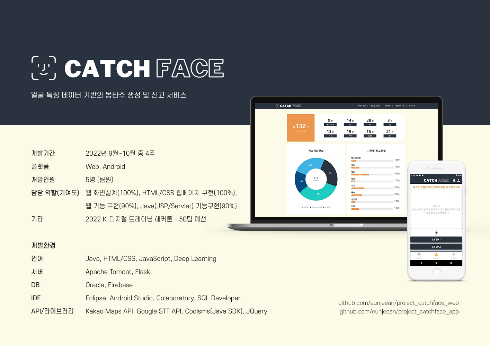
 
## 서비스 기획 및 방향성 설계
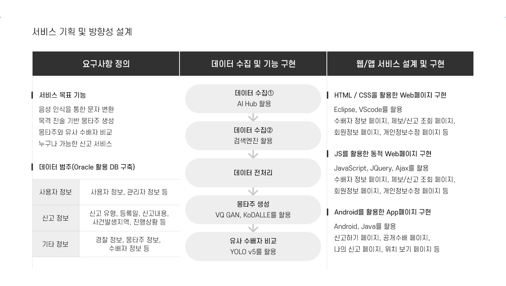
 
## 주제선정
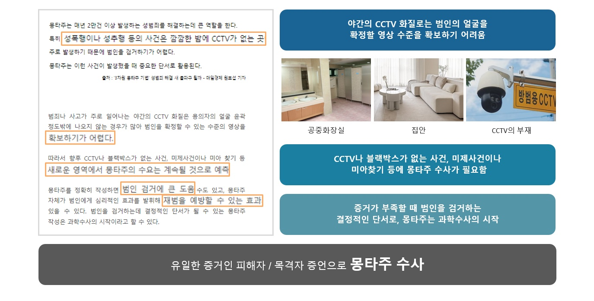
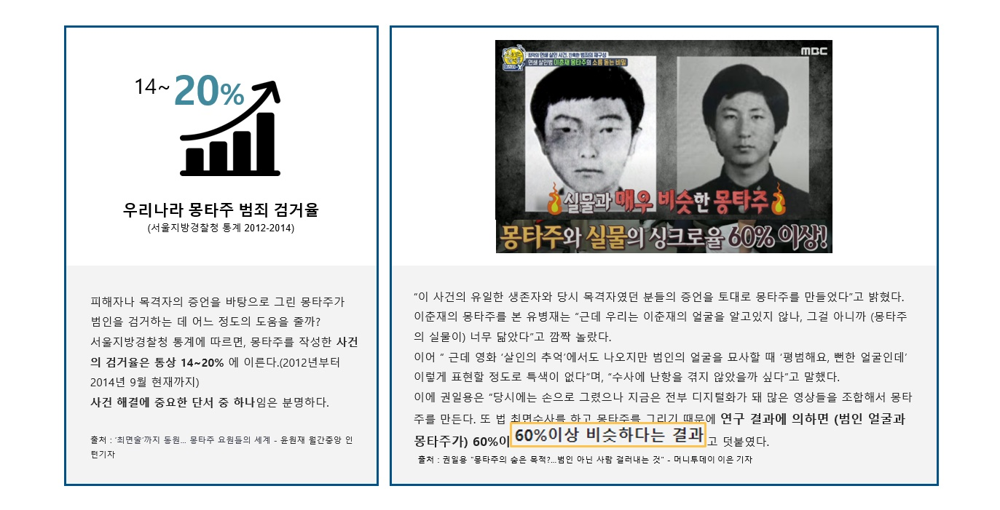
 
## 프로젝트 소개
- GAN 모델 기반의 몽타주를 생성 및 제공해 범죄 수사에 도움을 줄 수 있는 빅데이터 분석 시스템 및 누구나 신고 가능한 자체적인 신고 서비스
- 사용자 참여 중심의 목격자 제보 서비스로서 안심 치안, 사회안전망을 구축하고자 함
- 목격자 제보 진술 내용 기반으로 사용자가 몽타주를 직접 제작해서 용의자를 특정할 수 있으며, 몽타주와 현재 수배자 데이터를 통해 몽타주와 수배자를 비교하여 신고 가능
- 사용자들이 신고한 내용을 수치화하여 사용자 거주지 위치에 맞춰 우리 동네 알림 서비스 제공
- 경찰 사용자(web), 일반 사용자(app)로 페이지를 구분하여 실시간 신고 및 관리

 

## 프로젝트 특장점
- 신고 시, 목격자가 몽타주를 바로 제작하여 용의자를 특정할 수 있으며, 경찰 사용자가 신고내용을 통해 빠르고 자세한 진술 기반의 수사로 검거율을 높일 수 있음
- 사용자가 편안한 환경에서 진술 및 신고가 가능하여 수사 과정을 기다릴 필요없기 때문에 빠른 진술과 신고를 통해 피해자/목격자의 기억 왜곡을 줄일 수 있음
- 인터넷을 통해 작성하기에 시간제한이 없어 실시간 신고가 가능
- 거주지 위치 기반의 실시간 알림 서비스의 활용으로 범죄 예방할 수 있으며, 사회 위험, 불안 요소를 사용자들이 직접 신고함으로써 범죄 예방 및 사건 해결에 중요한 역할이 됨

 

## 서비스설계도
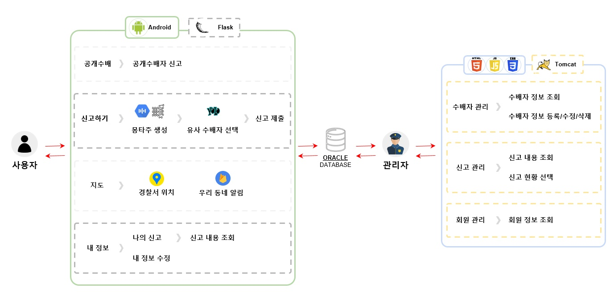
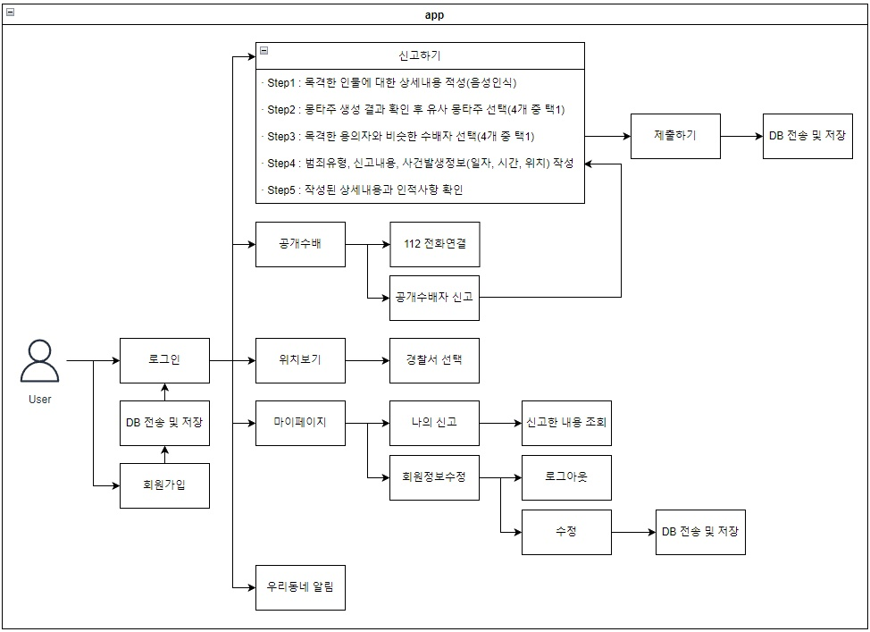
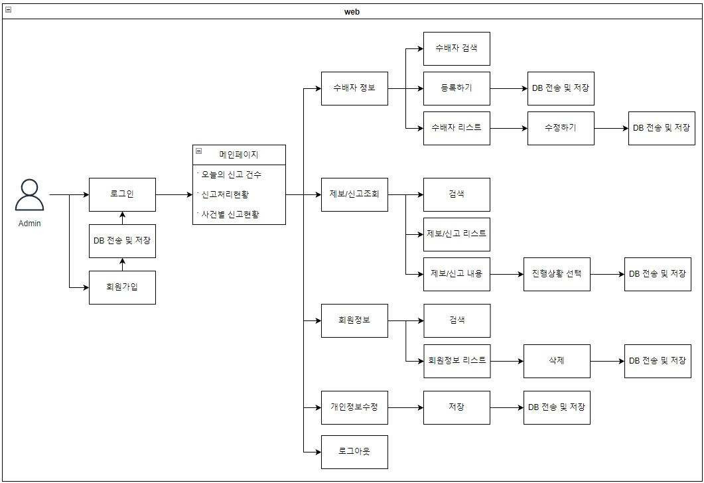

 

## 개발내용
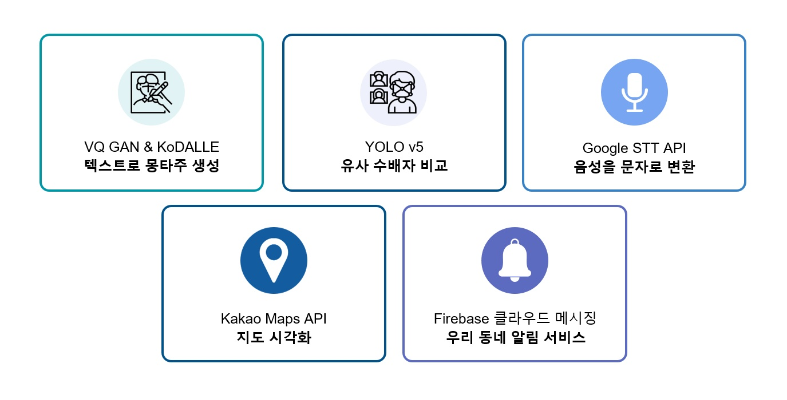

데이터 수집 
 - 수집처 : aihub - 페르소나 기반의 가상 인물 몽타주
 - 약 80,000장[가상인물스케치(10,000장), 몽타주스케치(상/중/하 각 10,000장), 
 몽타주설명문(상/중/하 각 10,000장), 최종검수이미지(10,000장)]
 - 직접 수집: 수배자용 연예인 이미지(9,000장) 
 
데이터 처리
 - 수집 데이터 사이즈 조절 및 얼굴 라벨링
 
몽타주 제작 구현
 - 한국인 얼굴 분석 (VQGAN)
 - 라벨링 몽타주 출력 (KoDALLE)
 
몽타주 비교 구현
 - 수배자 이미지 유사도 (YOLO v5)
 - 얼굴인식 (open CV)
 
음성 문자화 구현 (STT API)

우리동네 알림 서비스 및 파출소 찾기
 - 위치관련 지도 구현 (Kakao Maps API)
 
 

## 기능소개 (APP)
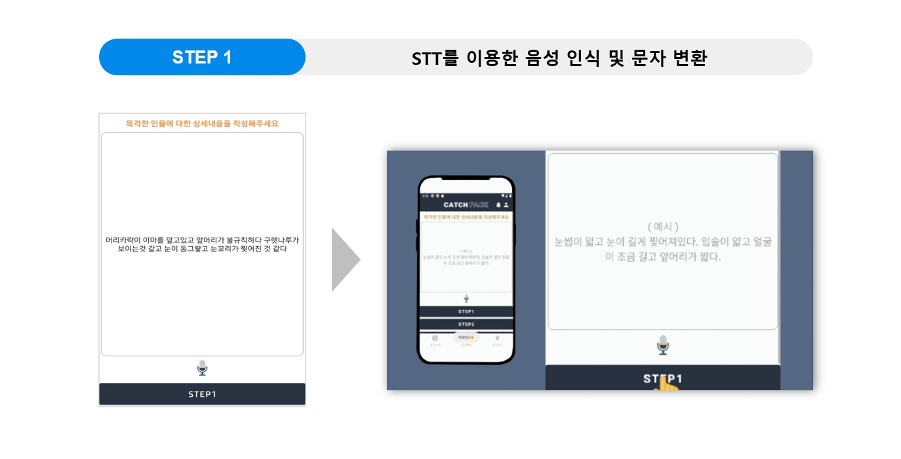
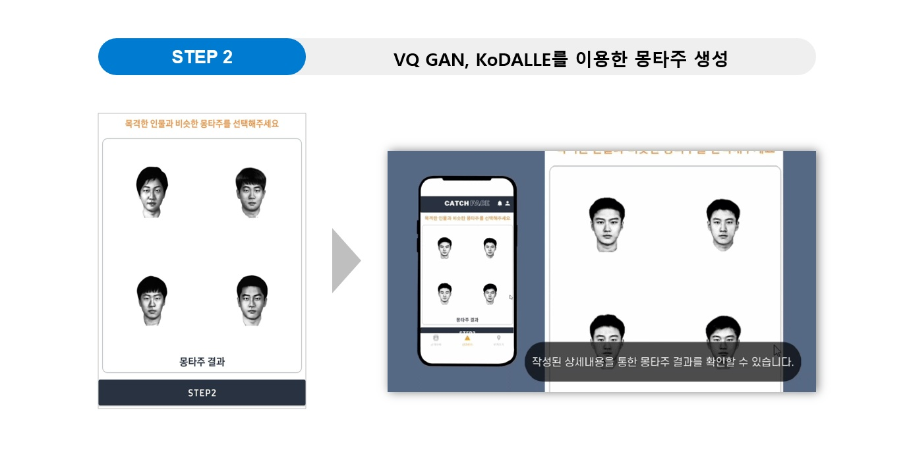

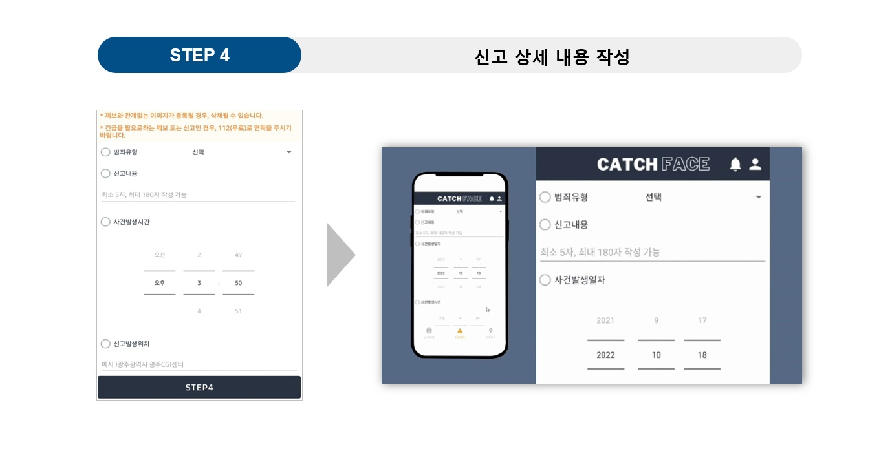
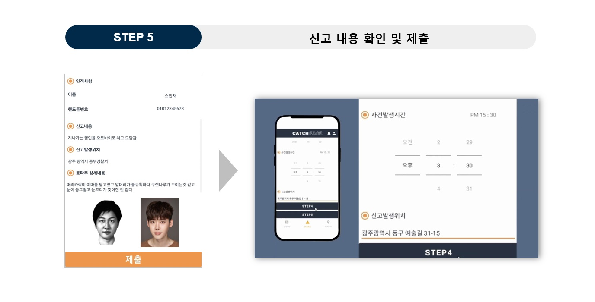

 

## 기능소개 (WEB)
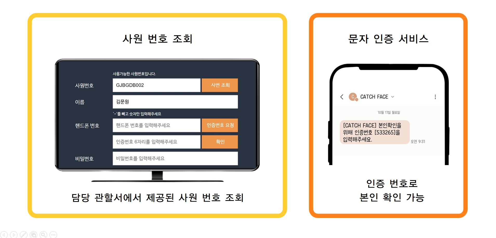
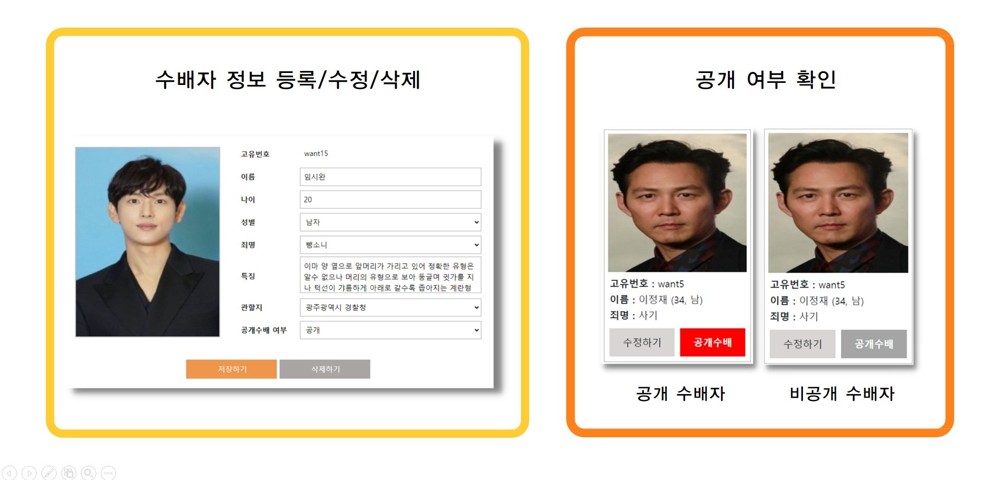
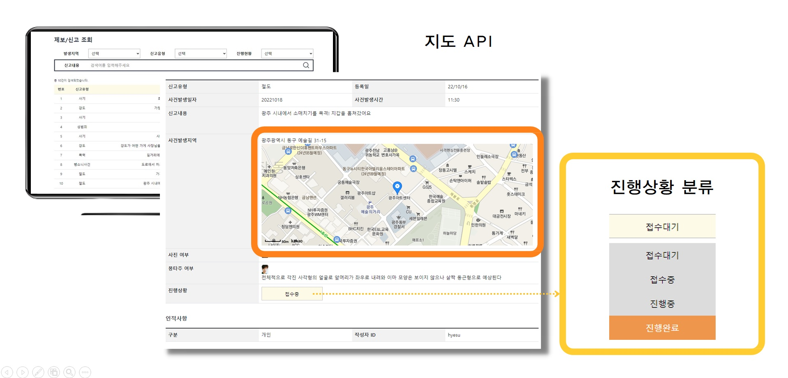

 

## 프로젝트 결과물
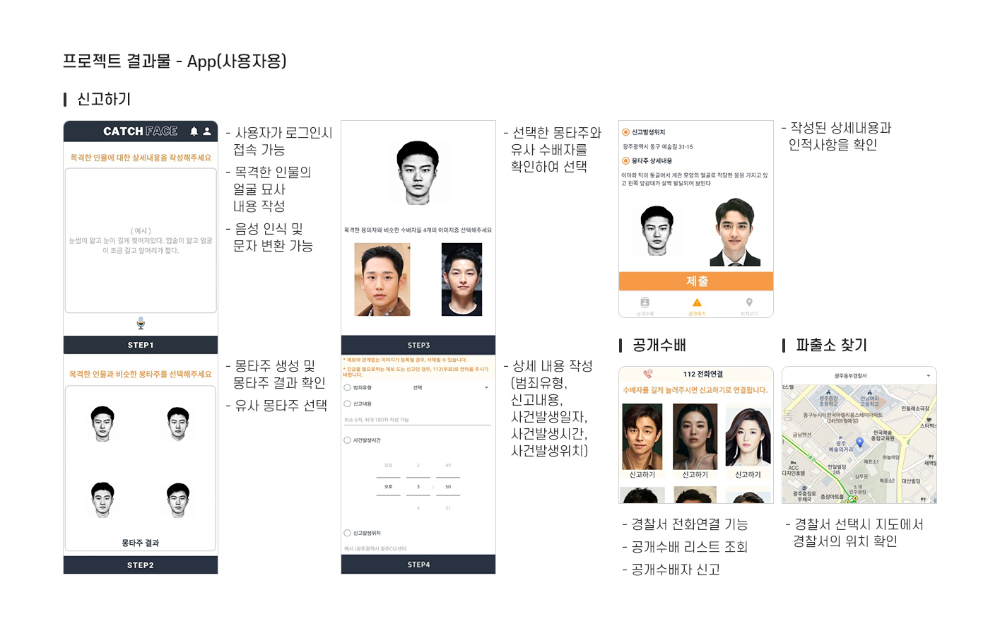
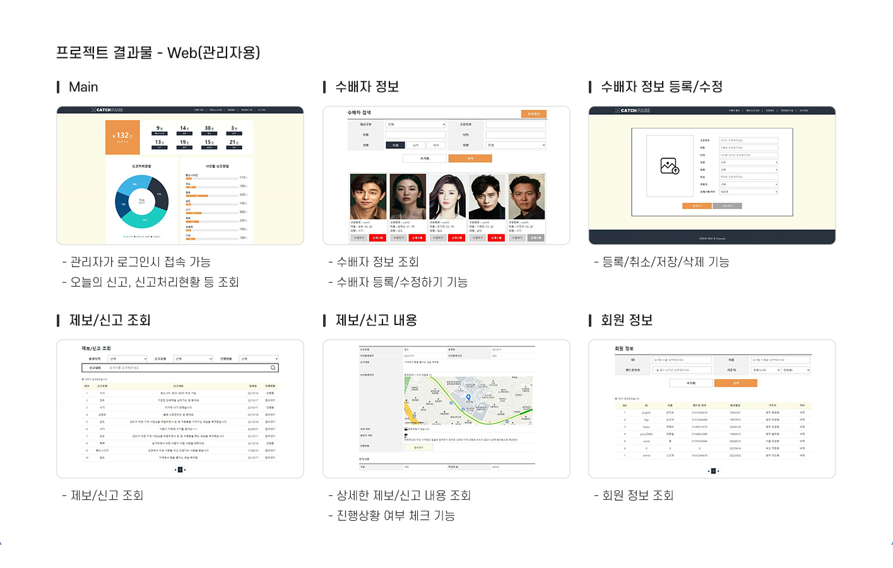

 

## 주요 사용 기술 및 기대효과
1. 주요 사용 기술
 - JSP/Servlet을 이용한 웹 서비스 구현
 - Android Studio를 이용한 앱 서비스 구현
 - 데이터 저장을 위한 Oracle SQL Developer 운용 기술
 - Google Speech to Text API를 이용한 음성을 문자로 변환
 - Kakao Maps API를 이용한 우리 동네 알림 및 지도 시각화
 - Firebase 클라우드 메시징을 이용한 우리 동네 알림 서비스
 - VQGAN을 이용한 몽타주 생성
 - KoDALLE를 이용한 텍스트로 몽타주 제작
 - YOLO를 이용한 수배자 이미지 유사도

2. 기대효과
 - 목격자 진술 시, 심리적으로 편안한 분위기에서 진행할 수 있음
 - 목격자의 경찰조사 시간을 단축할 수 있음
 - 빠른 몽타주 제작으로 피해자/목격자의 기억 왜곡이 적음
 - 신고 시간이 제한이 없어 실시간 신고가 가능
 - 빠르고 자세한 기반의 수사로 검거율을 높일 수 있음
  

